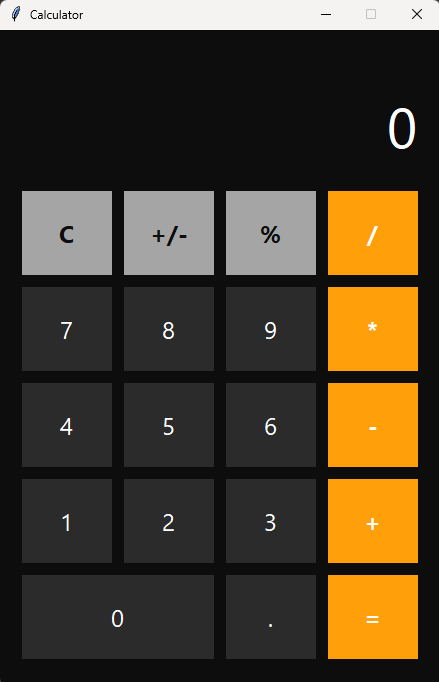

# 🧮 Python GUI Calculator

A modern GUI Calculator built with **Python** and **Tkinter**, featuring a clean and intuitive interface for performing basic arithmetic operations. This project demonstrates Python GUI development, event-driven programming, and user-friendly desktop application design.

---

## 📸 Screenshot

<p align="center">
  
</p>

---

## ✨ Features

* Modern GUI using Tkinter
* Addition, Subtraction, Multiplication, and Division
* Responsive button-based interface
* Clear and Delete functionality
* Error handling for invalid calculations
* Lightweight and beginner-friendly

---

## 🛠 Technologies Used

* Python 3
* Tkinter

---

## 🚀 Installation

Clone the repository:

```bash
git clone https://github.com/yasithpramodya/Python_Calculator.git
```

Navigate to the project folder:

```bash
cd Python_Calculator
```

Run the application:

```bash
python calculator.py
```

---

## 📂 Project Structure

```text
Python_Calculator/
│── assets/
│   └── calculator.png
│── calculator.py
│── README.md
│── .gitignore
```

---

## 🎯 Learning Outcomes

* Python Programming
* Tkinter GUI Development
* Event-Driven Programming
* Functions and Exception Handling
* Desktop Application Development

---

## 👨‍💻 Author

**Yasith Pramodya**

GitHub: https://github.com/yasithpramodya

⭐ If you like this project, consider giving it a star!
